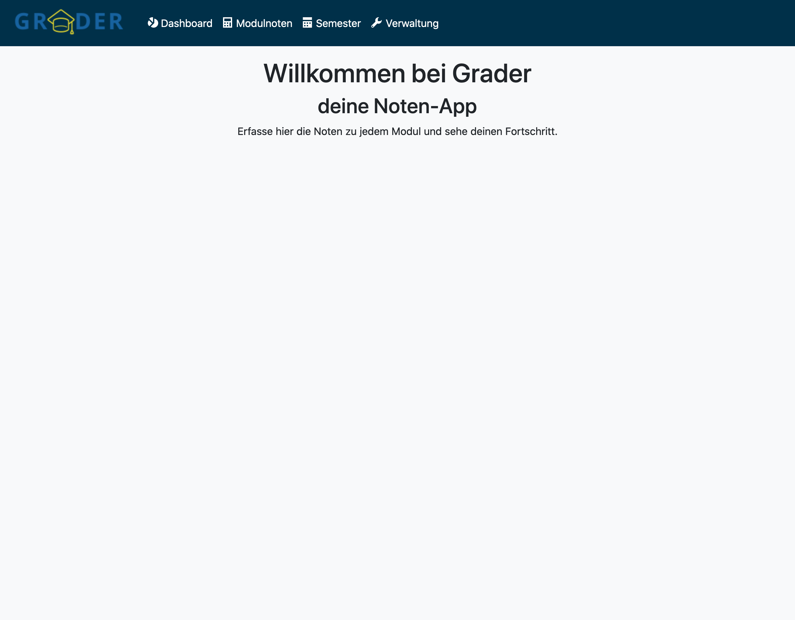
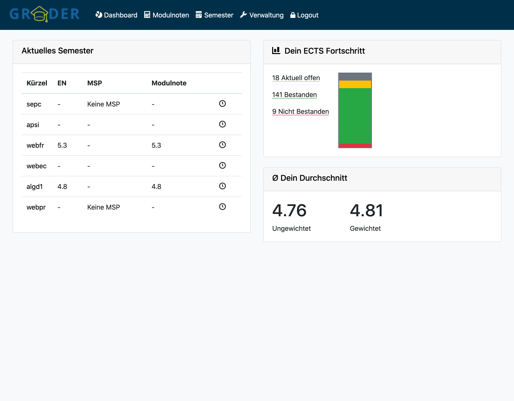
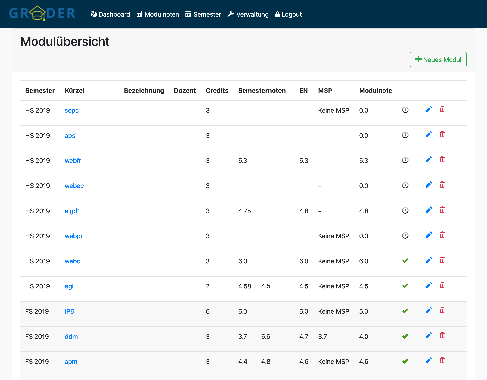
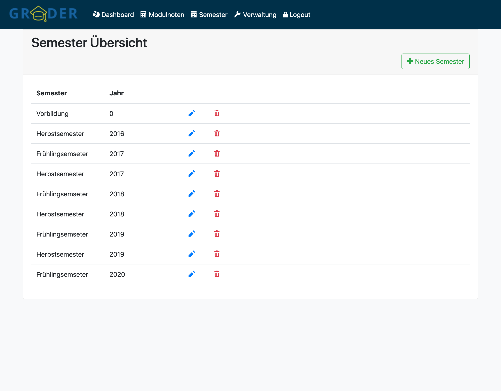
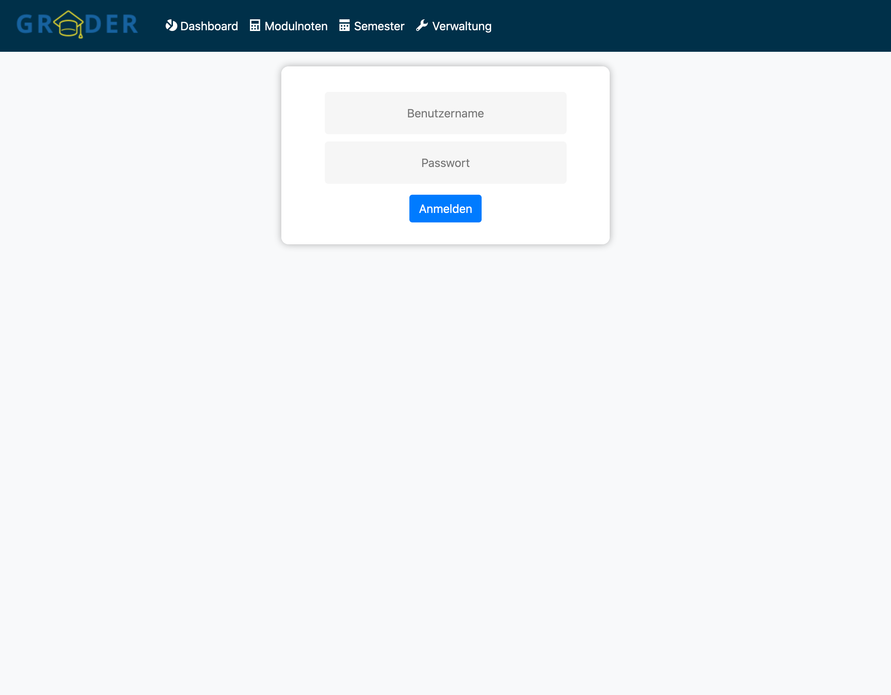

# WebEngineering Module, Graded Exercise

## Commit Proposal

Project idea short description: 

Bei diesem Projekt handelt es sich um eine Notenerfassungs-App genannt *Graded*.
Die App hat folgende Features:

### Use-Cases
#### Semester
- ✔ Ich kann ein Semester mit Jahr und FS oder HS erfassen.
- ✔ Ich kann ein Semester bearbeiten.
- ✔ Ich kann ein Semester ohne Module löschen.
- ✔ Ich kann ein Semester mit Modulen nicht löschen.
#### Module
- ✔ Ich kann ein Modul mit Bezeichnung, Kürzel, Dozent erfassen.
- ✔ Ich kann die Bezeichnung, das Kürzel oder den Dozenten bearbeiten.
- ✔ Ich kann ein Modul einem Semester zuweisen.
- ✔ Ich kann ein Modul einem zweiten Semester zuweisen, wenn das Modul nicht bestanden ist.
- ✔ Ich kann bestimmen wie die Modulnote entsteht.
  - ✔ Nur Erfahrungsnote
  - ✔ Erfahrungsnote und MSP
  - ✔ Nur MSP
  - ✔ Testatarbeit
- ✔ Ich kann definieren aus wievielen Noten ~~und zu wieviel Prozent die Modulnote besteht~~.
- ✔ Ein Modul wird als bestanden oder nicht bestanden gekennzeichnet.
- ✔ Einem Modul kann ich hinterlegen wieviele Credits erhalten werden.
#### Übersicht
- ✔ In der Übersicht sehe ich welche Module ich im aktuellen Semester besuche und welche Noten inkl. Schnitt ich habe.
- ✔ Ich sehe wieviel Module ich schon besucht und bestanden habe und wieviele ich noch benötige.
- ✔ Ich sehe meinen Gesamtschnitt über alle Module (gewichtet und ungewichtet).
#### Benutzer und Rollen
- ✔ Es gibt die Rolle des Admin. ~~Dieser kann alles Modifizieren~.
- ✔ Es gibt die Rolle Student. Dieser kann seine Module modifizieren.
- ✔ Es gibt die Rolle Gast. ~~Dieser kann nur den Fortschritt und den Schnitt sehen.~
- ✔ Ein nicht angemeldeter Benutzer hat keine Einsicht in die Noten.~

#### TODO
- Unit Testing
- Spec Testing
- Summary

#### Note:

~~durchgestrichen~~ Requirement wurde weggelassen wegen knapper Resourcen
✔ Requirement wurde umgesetzt

### Printscreens
#### Willkommen

#### Dashboard

#### Module

#### Semester

#### Login

## Project confirmation

This is a very detailed description! Start small, with a minimum viable prototype. Extend if time permits.
You might start.

## Project delivery <to be filled by student>

How to start the project: (if other than `grailsw run-app`)

How to test the project:  (if other than `grailsw test-app`)

Hand-written, static HTML 
project description:      (if other than `index.html` in project root directory)

###External contributions:
- Popup: inspiriert durch https://codepen.io/mihaeltomic/pen/PqxVaq
- Icons: OpenIconic (https://useiconic.com/open)
- Login: inspiriert durch https://bootsnipp.com/snippets/dldxB

###Other comments:

- Als Style Hilfe wurde Bootstrap verwendet
- Icons von OpenIconic
- Die Verwaltung-Page wurde aus Zeitgründen nicht implementiert (nur Admins können die Seite sehen)
- Benutzer:
  - Admin: admin/admin
  - User: user/user
  - Guest: guest/guest
  
- Beispiel Daten in data.sql

###I'm particular proud of:

*Beim Submit des Moduls gab es das Problem, dass die Noten mehrfach submitted wurden. Sowohl Herr Ribeau als auch Herr König konnten mir nicht helfen. Ich könnte aber mit viel Recherche und Tüfteln das Problem erruieren und lösen.*

## Project grading 

< to be filled by lecturer>
